<p align="center">
  
</p>

<p align="center">
  <a href="http://finpulse.infinityfree.me/"></a>
  <a href="https://github.com/SamisDone/FinPulse/actions/workflows/tests.yml"></a>
  
  
  <a href="LICENSE"></a>
</p>

<p align="center">
  <b>A quiet ledger for your income, spending, budgets and savings goals.</b><br>
  No bank logins, no ads, no trackers.
</p>

<p align="center">
  <a href="http://finpulse.infinityfree.me/"><b>Try FinPulse →</b></a>
</p>

<p align="center">
  <a href="#features">Features</a> ·
  <a href="#screenshots">Screenshots</a> ·
  <a href="#how-its-built">How it's built</a> ·
  <a href="#security">Security</a> ·
  <a href="#license">License</a>
</p>

<br>

<p align="center">
  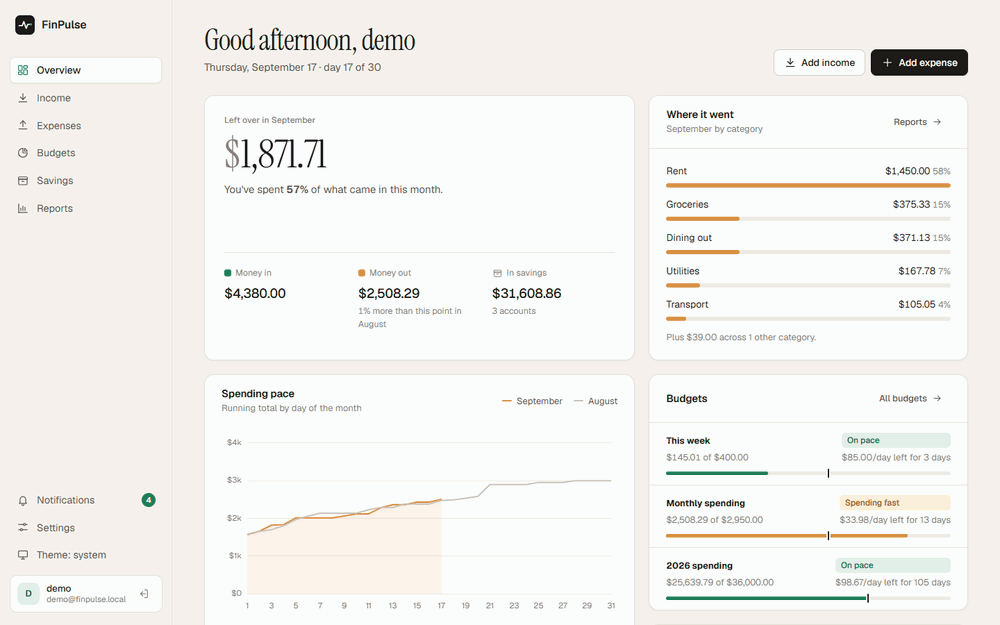
</p>

---

## Why FinPulse

Most budgeting apps want your bank credentials, your attention and eventually a monthly fee. FinPulse asks for none of that.

- **Built for a monthly check-in.** Open it, log what happened, see whether you're on pace, and close it.
- **Honest numbers.** Month-to-date comparisons are made against *the same point* last month, not the whole month, so the middle of the month doesn't make you look like a saint.
- **Tells you before it's too late.** Budget alerts, reminders before recurring bills, and a summary when each month closes.
- **Yours to take away.** Export every entry as a spreadsheet or any report as a PDF.

## Features

<table>
<tr>
<td width="50%" valign="top">

### Log spending in seconds
Amount, date, category, done. Type a category that doesn't exist yet and it's created as you save. The ledger groups entries by day with daily totals, and the form stays focused so you can enter a stack of receipts in a row.

- Edit or delete any entry, with a proper confirmation dialog
- Search notes and names, filter by category, browse month by month
- Month-over-month comparison right above the list

</td>
<td width="50%" valign="top">
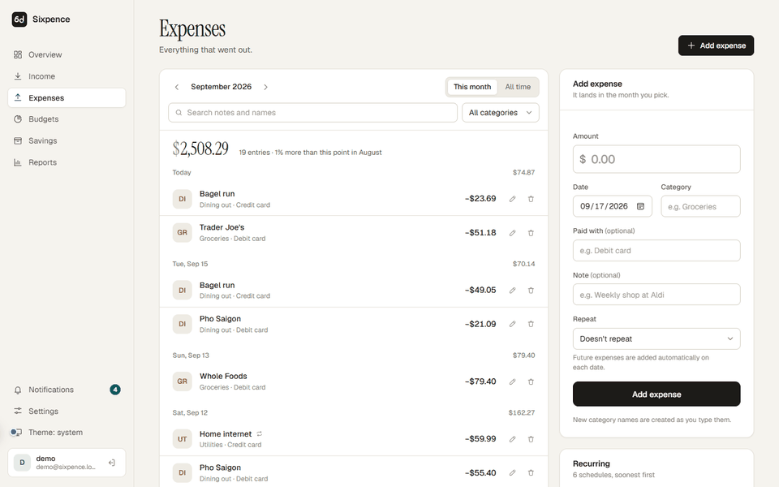
</td>
</tr>
</table>

### Recurring income and bills
Mark rent, a paycheck or a subscription as repeating weekly, every two weeks, monthly, quarterly or yearly. Each occurrence is added automatically on its date, catching up if nobody opened the app for a while, and month-end dates behave sensibly (a bill on the 31st lands on Feb 28, then back on Mar 31). Schedules are listed beside the ledger and can be stopped at any time.

### Budgets that show your pace
Each budget shows what you've spent, what's left **per day**, and a marker on the bar for where an even pace would put you today. Statuses read like a person would say them: *On pace*, *Spending fast*, *Over limit*, *Stayed under*. Add optional caps per category, and pick Weekly, Monthly or Yearly to have the end date filled in for you.

### Savings goals with a monthly number
Give a goal a target and a date and FinPulse works out how much to set aside each month. Use **Add money** as you save; goals move to *Reached* when they're funded.

### Notifications, in the app and by email
- **Budget alerts** at 80% and when a budget or category cap goes over
- **Upcoming payments** three days before a recurring expense is added
- **Monthly summary** of what came in, what went out and the biggest categories
- **Security notices** whenever a password changes

Each type can be switched off, and email is optional. Notifications are listed on their own page with an unread badge in the navigation.

### Reports you can take with you
Pick a range (this month, last month, last 3 or 12 months, year to date, or custom dates) and get income, spending, net and savings rate compared with the previous period, charts that switch between days, weeks and months to suit the range, a running balance, and a breakdown by category and source.

**Download PDF** produces a real vector document with selectable, searchable text; **CSV** gives you every entry for a spreadsheet.

<p align="center">
  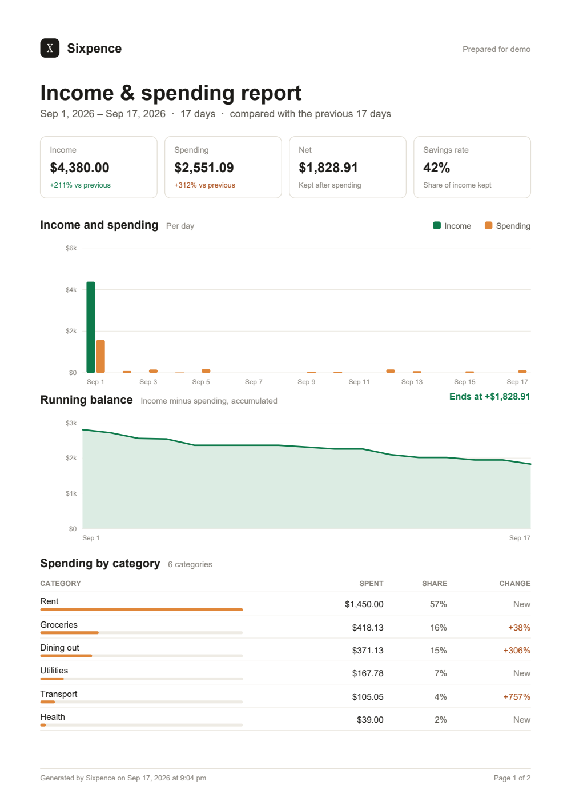
</p>

### Everything else
- **Password reset by email** with single-use links that expire after an hour
- **Light and dark themes** that follow your system, with a manual override
- **12 display currencies** (USD, EUR, GBP, BDT, INR, PKR, JPY, CAD, AUD, SGD, AED, CHF)
- **Responsive** from small phones to wide monitors
- **Keyboard friendly**: skip link, visible focus rings, <kbd>/</kbd> to search, <kbd>Esc</kbd> closes menus and dialogs
- **Account controls**: change username, email or password, export everything, or delete the account and all its data

## Screenshots

<table>
<tr>
<td colspan="2">
<picture>
  <source media="(prefers-color-scheme: dark)" srcset="docs/media/overview-dark.png">
  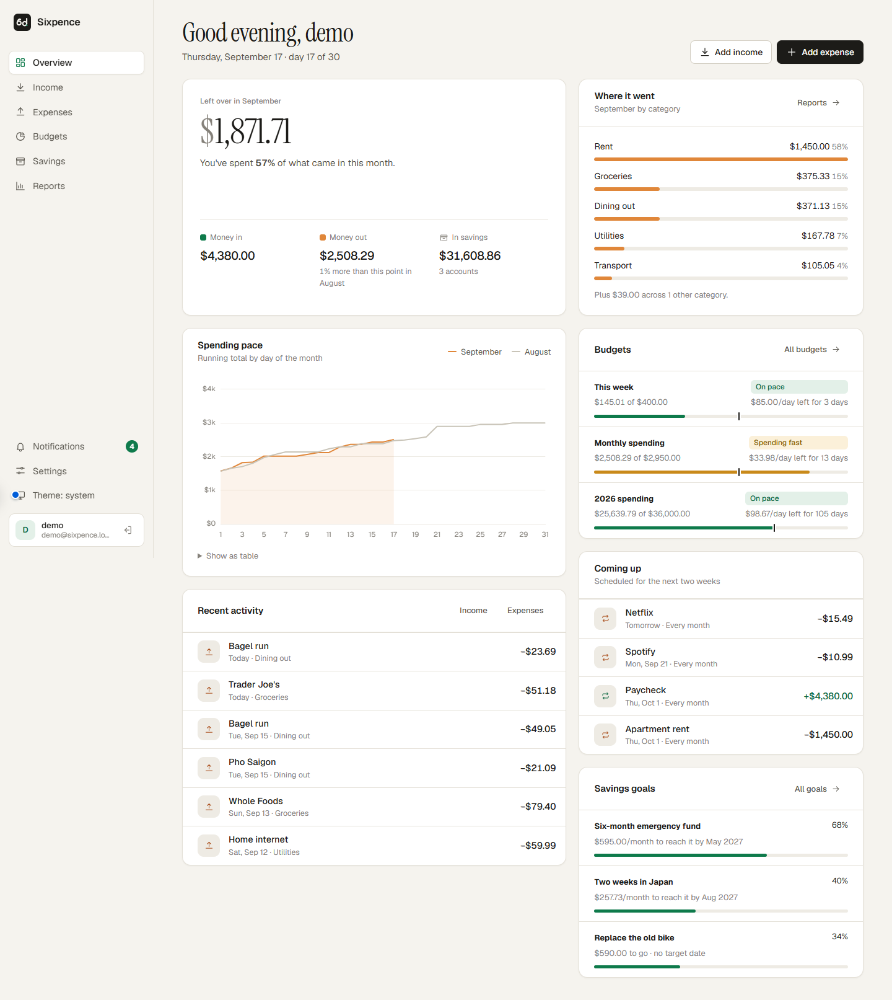
</picture>
<p align="center"><sub><b>Overview</b>: what's left this month, where it went, your pace, what's coming up, and your goals.</sub></p>
</td>
</tr>
<tr>
<td width="50%"><p align="center"><sub><b>Expenses</b>: a day-by-day ledger with recurring schedules</sub></p></td>
<td width="50%">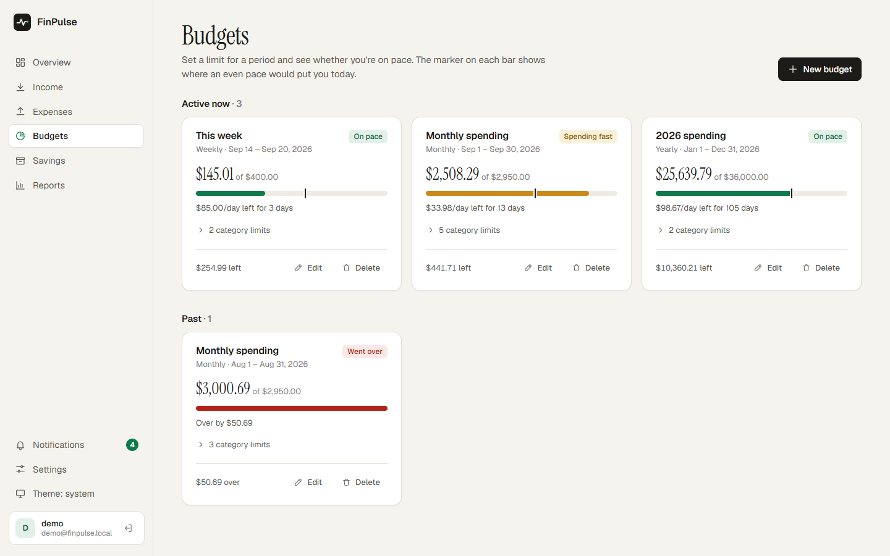<p align="center"><sub><b>Budgets</b>: pace markers and plain-language status</sub></p></td>
</tr>
<tr>
<td width="50%">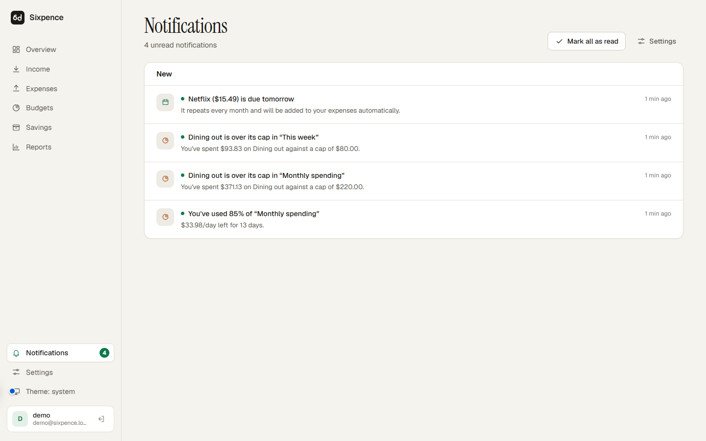<p align="center"><sub><b>Notifications</b>: budget alerts and upcoming payments</sub></p></td>
<td width="50%">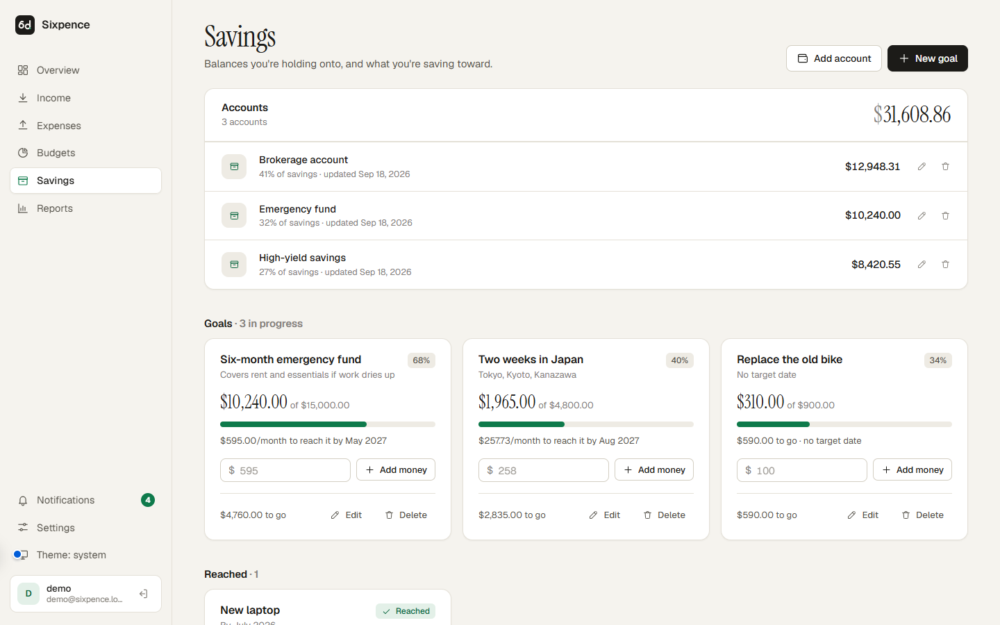<p align="center"><sub><b>Savings</b>: accounts and goals with a monthly number</sub></p></td>
</tr>
<tr>
<td width="50%">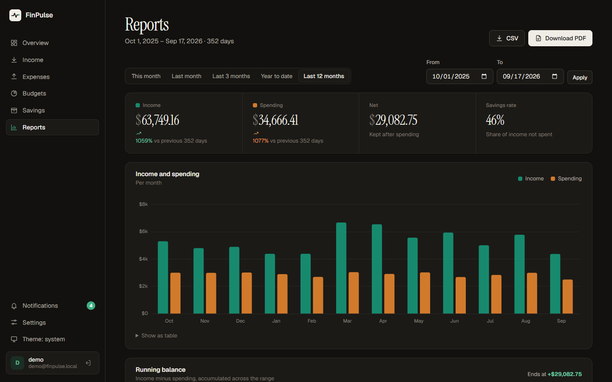<p align="center"><sub><b>Reports</b>: period comparisons, charts and exports</sub></p></td>
<td width="50%">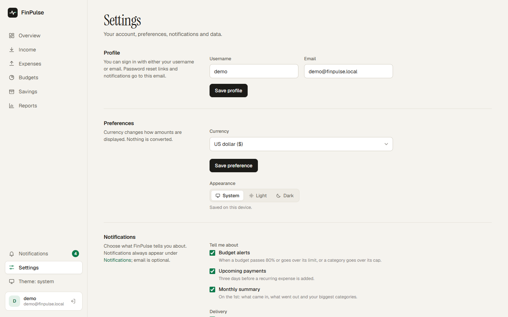<p align="center"><sub><b>Settings</b>: currency, theme and notifications</sub></p></td>
</tr>
</table>

<details>
<summary><b>Light and dark themes</b></summary>
<br>
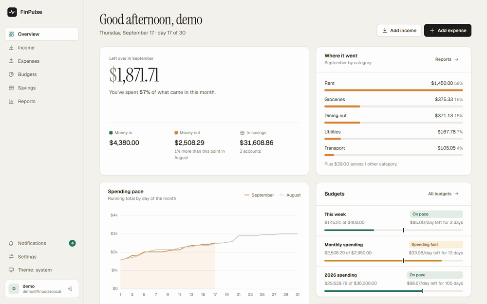
</details>

<details>
<summary><b>On your phone</b></summary>
<br>
<table>
<tr>
<td width="25%" valign="top">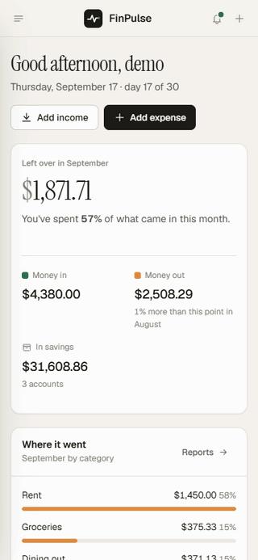</td>
<td width="25%" valign="top">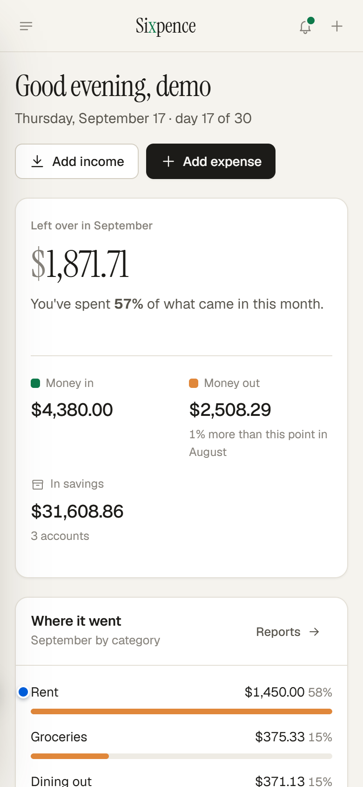</td>
<td width="25%" valign="top">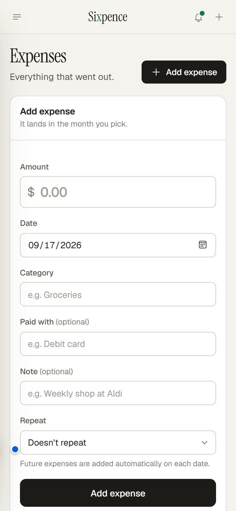</td>
<td width="25%" valign="top">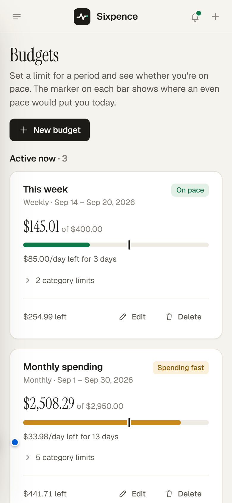</td>
</tr>
</table>
</details>

<details>
<summary><b>Landing page, sign in and password reset</b></summary>
<br>
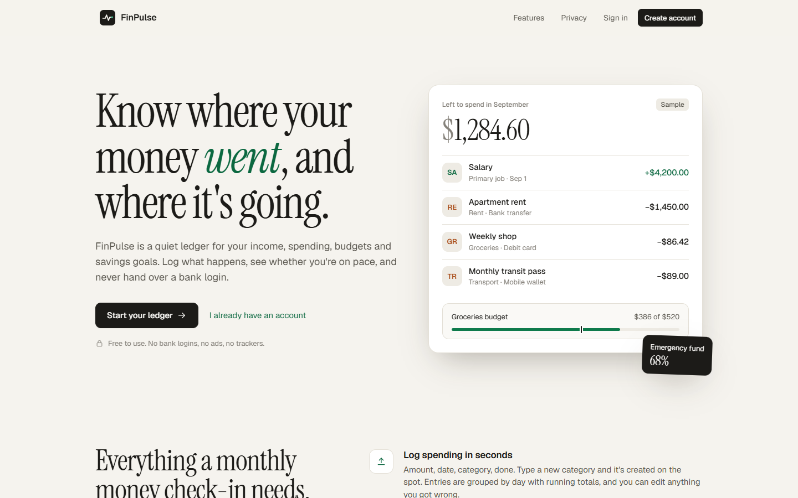
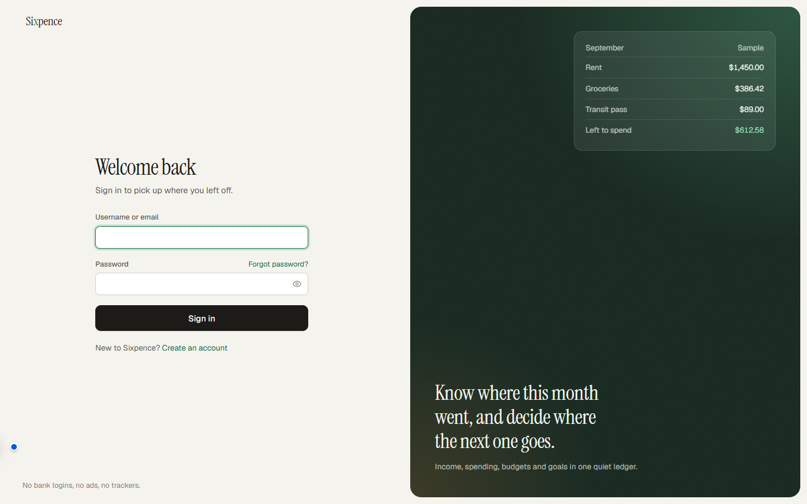
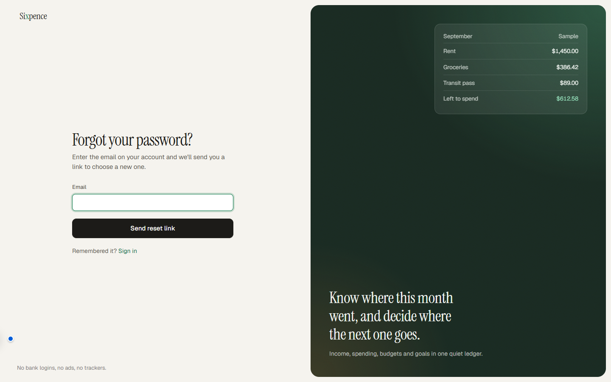
<br>
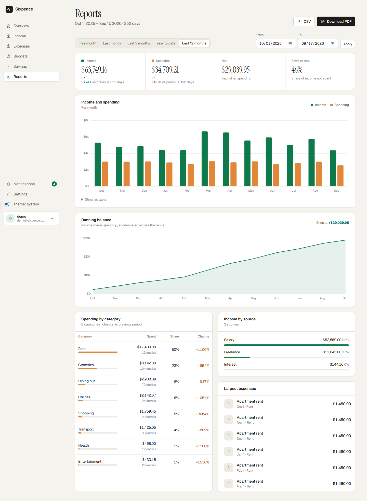
</details>

## How it's built

FinPulse is plain PHP 8.1+ with no framework, no Composer packages and no build step, backed by SQLite or MySQL.

- **One entry point.** `public/` is the only web-accessible folder. `public/index.php` routes clean URLs like `/expenses` to pages in `app/pages`; application code, the database and scripts all live outside the web root.
- **Post/Redirect/Get everywhere.** Forms validate, save, flash a message and redirect, so refreshing never resubmits. Failed validation keeps what you typed and shows errors beside each field.
- **Self-contained front end.** One CSS design system with light and dark tokens, a little progressive-enhancement JavaScript, and fonts and Chart.js served locally. Every page works without JavaScript.
- **Its own PDF engine and mail client.** Reports are drawn as vector PDFs by a small in-house writer; email goes through a built-in SMTP client (STARTTLS/SSL, AUTH) behind a queue, so a slow mail server never slows a page.
- **Schema migrations** run automatically on both SQLite and MySQL, and older databases upgrade in place.
- **Tested.** A dependency-free suite of 65 unit and end-to-end tests covers money handling, recurrence, budgets, notifications, email, PDF output, migrations, and security properties such as CSRF, access control, escaping and rate limits. A GitHub Actions workflow runs it on PHP 8.1 to 8.4 with SQLite, and on MySQL 8.

```
app/
  core/       bootstrap, config, router, database & migrations, auth, layout, helpers, icons
  services/   finance, recurring, notifications, mail, reports, PDF
  pages/      one file per screen
public/       index.php and assets (the only folder the web server serves)
database/     schema.sqlite.sql, schema.mysql.sql
scripts/      cron.php (scheduled upkeep), seed-demo.php (demo data)
tests/        run.php, unit and feature tests
```

## Security

| Area | What FinPulse does |
| --- | --- |
| **Content Security Policy** | Scripts, styles, fonts and images may only come from FinPulse itself; framing is blocked. |
| **SQL injection** | Every query uses prepared statements; table names come only from fixed allow-lists. |
| **XSS** | All output is escaped; chart data is embedded as JSON with HTML-significant characters escaped. |
| **CSRF** | Every form carries a per-session token. Signing out is a POST. |
| **Access control** | Every read and write is scoped to the signed-in user, with ownership checked before changes. |
| **Brute force** | Failed sign-ins are tracked in the database: 5 attempts, then a 15-minute lockout. Password-reset requests are rate limited too. |
| **Passwords** | Hashed with `password_hash()` and rehashed as defaults improve. Changing or resetting a password signs out every other session and sends a security email. |
| **Password reset** | 256-bit single-use tokens, stored only as hashes, valid for one hour. The form gives the same answer whether or not an account exists. |
| **Sessions** | `HttpOnly`, `SameSite=Lax`, `Secure` over HTTPS, strict mode, ID regenerated at sign-in. |
| **Exports & email** | CSV cells that a spreadsheet would run as formulas are neutralised; email headers can't be injected. |

Found a security issue? Please report it privately through [GitHub](https://github.com/SamisDone) rather than opening a public issue.

## License

Copyright © 2026 Samonwita Sarker. **All rights reserved.**

This repository is public so the work can be seen, but it is **not** open source. You may not copy, modify, redistribute, host or reuse the code, design or assets without written permission. See [LICENSE](LICENSE) for details. To use FinPulse, visit the [live site](http://finpulse.infinityfree.me/).
